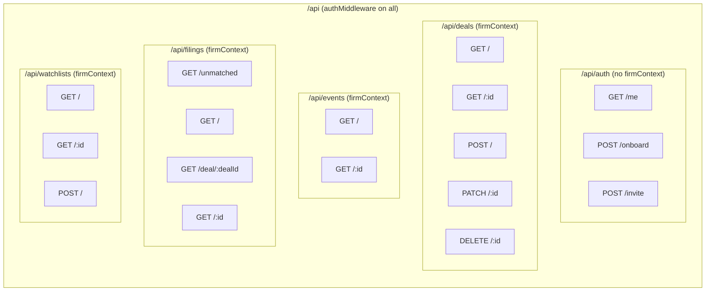
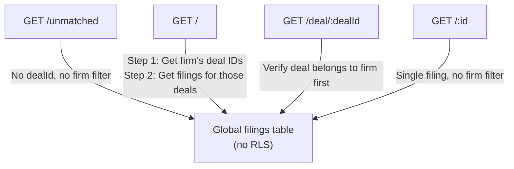

# API Routes

## Overview
REST API built with Hono, mounted at `/api`. Five route groups: auth, deals, events, filings, watchlists. All use Zod validation and `adminDb` with manual firm scoping.

## Route Map

## Auth Routes (`/api/auth`)

| Endpoint | Purpose | Notes |
|---|---|---|
| `GET /me` | Current user identity + firm membership | Returns `{ firm: null }` if not onboarded |
| `POST /onboard` | First-time firm setup | Creates firm → admin role → seeds deals → audit log |
| `POST /invite` | Invite team member | Admin-only, sends Supabase invite email, records in `invites` table |

**Onboard flow creates 4 records:** firm, firmMember (admin), seed deals (via `seedFirm`), audit log entry.

**Invite gotcha:** Uses `adminDb` to manually check caller's firm + role since firmContextMiddleware isn't applied. Creates a Supabase admin client per-request to send the invite email — this is intentional (service role key needed).

## Deals Routes (`/api/deals`)

| Endpoint | Purpose | Notes |
|---|---|---|
| `GET /` | All deals for firm | Filters `deletedAt IS NULL`, orders by `createdAt` |
| `GET /:id` | Single deal | Firm-scoped + soft-delete check |
| `POST /` | Create deal | `firmId` always from JWT, never client |
| `PATCH /:id` | Partial update | Sets `updatedAt` to `new Date()` |
| `DELETE /:id` | Soft delete | Sets `deletedAt` + `updatedAt` |

**Security pattern:** `firmId` is NEVER accepted from the client body. It's always sourced from `c.get('firmId')` (JWT). The `createDealSchema` intentionally omits `firmId`.

**Zod schema note:** Numeric fields (`dealValue`, `pricePerShare`, etc.) are typed as `z.string().optional()` — the DB stores them as `numeric` (Drizzle handles the conversion). Don't pass numbers.

## Events Routes (`/api/events`)

| Endpoint | Purpose | Notes |
|---|---|---|
| `GET /` | All events for firm | Optional `?dealId=` query filter |
| `GET /:id` | Single event | Firm-scoped |

Events are read-only from the API perspective. They're created by the EDGAR ingestion pipeline's `event-factory.ts`, not by user actions.

## Filings Routes (`/api/filings`)

**Critical distinction:** The `filings` table is GLOBAL (no `firm_id` column, no RLS). Firm scoping is achieved indirectly:
- `GET /` — queries firm's deals first, then gets filings for those deal IDs
- `GET /deal/:dealId` — verifies deal belongs to firm before returning filings
- `GET /unmatched` — returns ALL unmatched filings regardless of firm (review queue)
- `GET /:id` — returns any filing by ID (no firm filter — filings are shared)

**Route ordering gotcha:** `/unmatched` is defined BEFORE `/:id` in the route chain. If reversed, `/:id` would match the string "unmatched" as a UUID parameter and return 404.

## Watchlists Routes (`/api/watchlists`)

| Endpoint | Purpose | Notes |
|---|---|---|
| `GET /` | All watchlists for firm | Firm-scoped, soft-delete filtered |
| `GET /:id` | Single watchlist + deals | Joins `watchlist_deals` → `deals`, filters deleted deals in-memory |
| `POST /` | Create watchlist | `firmId` + `createdBy` both from JWT |

**GET /:id detail:** The nested deals query uses an `innerJoin` on `watchlist_deals` → `deals`, scoped by `firmId`. Soft-deleted deals are filtered out in JavaScript (`.filter(d => d.deletedAt === null)`) rather than SQL.

## Common Patterns Across All Routes

1. **All use `adminDb`** — bypasses RLS, manual firm_id filtering in WHERE clauses
2. **Soft deletes** — `deletedAt IS NULL` check on all list queries, `set({ deletedAt: new Date() })` on delete
3. **Zod validation** — `@hono/zod-validator` on POST/PATCH bodies
4. **Firm ID from JWT** — never from request body; `c.get('firmId')` everywhere
5. **No pagination yet** — all list endpoints return full result sets
6. **No sorting params** — hardcoded `orderBy` (createdAt for most, filedDate desc for filings)
