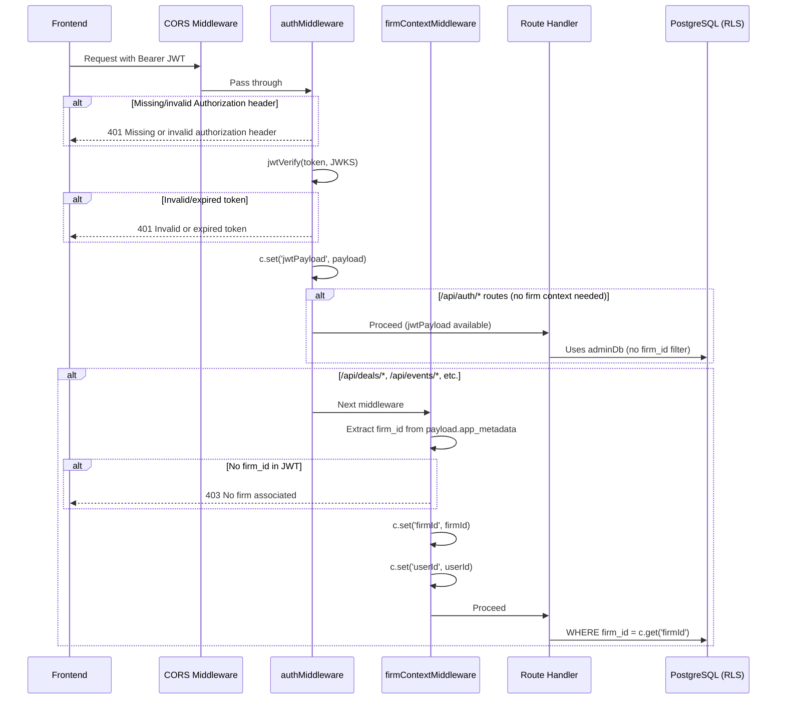
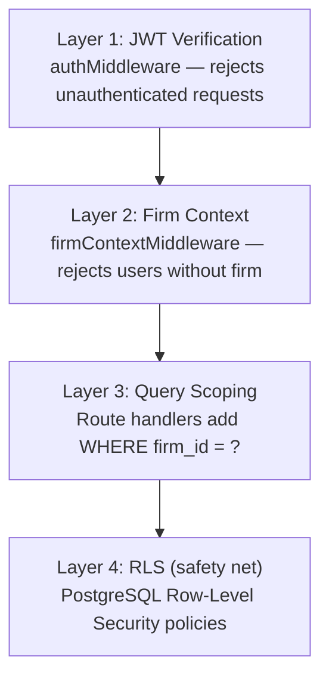

# Auth & Middleware

## Overview
Two-layer middleware stack: JWT verification (all `/api/*` routes) then firm context extraction (data routes only). Supabase JWKS for RS256 verification, Custom Access Token Hook injects `firm_id` into JWT `app_metadata`.

## Request Flow



## Middleware Application Map

```mermaid
graph TD
    subgraph "All /api/* routes"
        AUTH["authMiddleware<br/>JWT verification via JWKS"]
    end

    subgraph "Data routes only"
        FIRM["firmContextMiddleware<br/>Extracts firm_id + user_id"]
    end

    AUTH --> D["/api/deals/*"]
    AUTH --> E["/api/events/*"]
    AUTH --> F["/api/filings/*"]
    AUTH --> W["/api/watchlists/*"]
    AUTH --> A["/api/auth/*"]

    FIRM --> D
    FIRM --> E
    FIRM --> F
    FIRM --> W

    style A fill:#2d4a2d,stroke:#4a7a4a
    style D fill:#4a2d2d,stroke:#7a4a4a
    style E fill:#4a2d2d,stroke:#7a4a4a
    style F fill:#4a2d2d,stroke:#7a4a4a
    style W fill:#4a2d2d,stroke:#7a4a4a
```



Green = authMiddleware only. Red = both authMiddleware + firmContextMiddleware.

## Why auth routes skip firmContextMiddleware

`/api/auth/me` and `/api/auth/onboard` are called by first-time users who have a valid JWT (Supabase account exists) but do NOT yet have a `firm_id` in their JWT `app_metadata`. The onboarding flow:

1. User signs up via Supabase Auth → gets valid JWT (no `firm_id`)
2. Frontend calls `GET /api/auth/me` → returns `{ firm: null }`
3. Frontend shows onboarding UI
4. User submits firm name → `POST /api/auth/onboard`
5. Backend creates firm, assigns admin role, seeds deals
6. Supabase Custom Access Token Hook adds `firm_id` to future JWTs
7. Next login, JWT contains `app_metadata.firm_id`

**Gotcha:** The `POST /api/auth/invite` endpoint also lives under `/api/auth/*` but DOES need firm context. It manually queries `firmMembers` to find the caller's firm instead of relying on the middleware.

## JWKS Configuration

```
JWKS URL: ${SUPABASE_URL}/auth/v1/.well-known/jwks.json
Algorithm: RS256 (asymmetric, with key rotation)
```

The JWKS client (`createRemoteJWKSet`) is created once at module level and caches keys across requests. This is important — creating it per-request would be slow and hammer the JWKS endpoint.

## Hono Context Variables

The `AuthEnv` type defines what's available on `c.get()`:

| Variable | Set by | Available in |
|---|---|---|
| `jwtPayload` | `authMiddleware` | All `/api/*` routes |
| `firmId` | `firmContextMiddleware` | Data routes only |
| `userId` | `firmContextMiddleware` | Data routes only |

**Anti-pattern:** Don't try to access `c.get('firmId')` in auth routes — it will be undefined. Use `payload.sub` for user ID and manually query `firmMembers` if you need firm context in auth routes.

## Three-Layer Security Model



**Defense-in-depth rationale:** For financial data, a single layer isn't enough. Even if a route handler bug omits the `firm_id` filter, RLS at the database level prevents data leakage between firms.

**Gotcha:** All current route handlers use `adminDb` (bypasses RLS) rather than `db` (respects RLS). This means Layer 4 is NOT actually active for most queries. The manual `WHERE firm_id = ?` in route handlers (Layer 3) is the real enforcement. RLS exists as insurance for future changes or if someone accidentally removes a firm_id filter.
