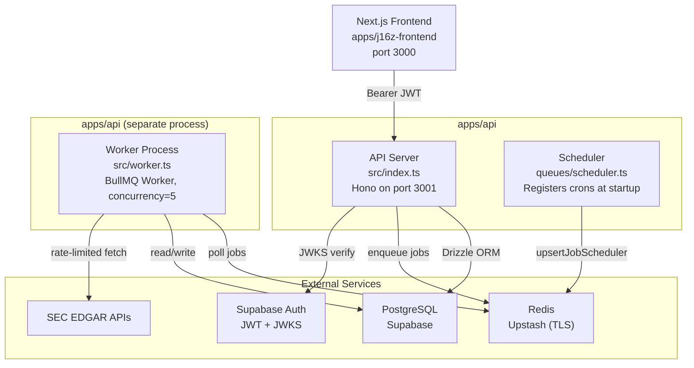
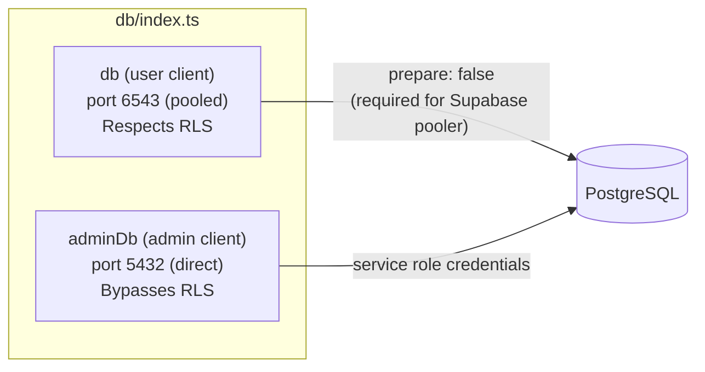
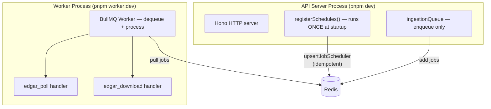

# Backend Overview

## Overview
The j16z backend is a Hono API server (`apps/api/`) with a separate BullMQ worker process for background ingestion jobs. PostgreSQL on Supabase, Upstash Redis for job queues.

## System Architecture



## Two DB Clients — Critical Distinction



**When to use which:**
- `db` — user-facing request handlers (currently unused in practice; all routes use `adminDb` with manual firm_id filtering + RLS as safety net)
- `adminDb` — webhooks, seed scripts, background jobs (worker), admin routes, and all current route handlers

**Gotcha:** Despite having a user-scoped `db` client, all current route handlers use `adminDb` and rely on manually adding `WHERE firm_id = ?` clauses. RLS is defense-in-depth, not the primary enforcement in route handlers. This is a deliberate belt-and-suspenders approach for financial data.

## Process Separation



**Critical:** Never import `registerSchedules` from `worker.ts`. The scheduler must only run in the API server process. If imported in the worker, every worker restart creates duplicate cron entries.

**Critical:** Never import worker handlers into `index.ts`. The Queue (enqueueing) and Worker (processing) are deliberately in separate processes.

## Key File Paths

| File | Purpose |
|---|---|
| `src/index.ts` | API server entry point, middleware wiring, route mounting |
| `src/worker.ts` | Separate worker process for background jobs |
| `src/db/index.ts` | Two Drizzle clients (user + admin) |
| `src/db/schema.ts` | All table definitions + RLS policies |
| `src/db/seed.ts` | Starter deal seeding for new firms |
| `src/middleware/auth.ts` | JWT verification via JWKS |
| `src/middleware/firm-context.ts` | Firm ID extraction from JWT |
| `src/routes/*.ts` | REST API route handlers |
| `src/edgar/*.ts` | EDGAR ingestion pipeline |
| `src/queues/*.ts` | BullMQ queue, connection, scheduler |

## Commands

```
pnpm dev           # API server with watch mode (tsx)
pnpm worker:dev    # Worker process with watch mode
pnpm build         # TypeScript → dist/
pnpm start         # Production API server
pnpm worker        # Production worker
pnpm db:generate   # Drizzle schema → SQL migrations
pnpm db:migrate    # Apply pending migrations
pnpm db:push       # Push schema directly (dev only)
pnpm db:seed       # Run seed script
```
