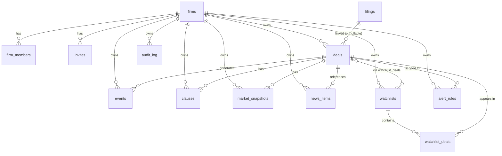
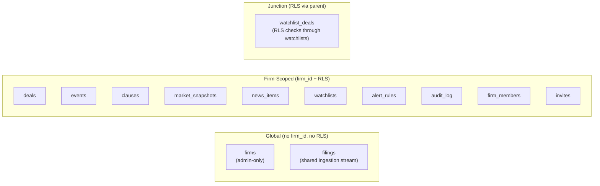
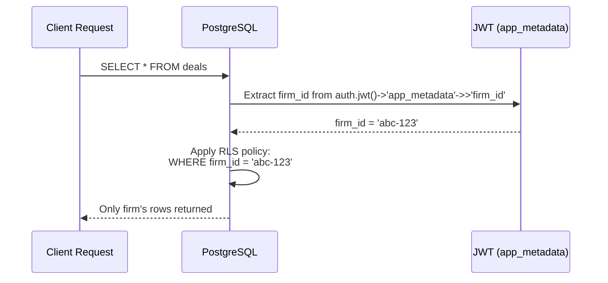
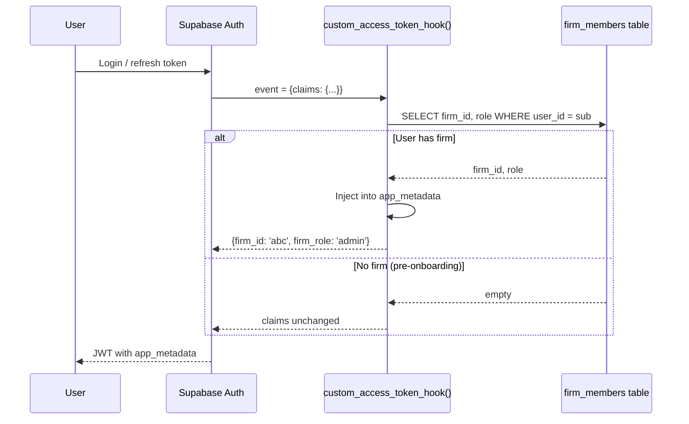

# Database Schema

## Overview
PostgreSQL on Supabase with Drizzle ORM. 13 tables split between global (no RLS) and firm-scoped (RLS enforced). UUID primary keys everywhere, soft deletes on most tables.

## Entity Relationship Diagram



## Global vs Firm-Scoped Tables



**Why filings are global:** The EDGAR ingestion pipeline inserts filings once globally. Firm-scoped Events are then created for each firm tracking the related deal. This avoids duplicating filing data per firm.

**Why deals can have `firm_id = null`:** Auto-discovered deals (from high-signal EDGAR filings) start unclaimed in a global discovery pool. They become firm-scoped when a firm claims them.

## Key Tables Detail

### deals

| Column | Type | Notes |
|---|---|---|
| id | UUID | PK, auto-generated |
| firm_id | UUID (nullable) | null = unclaimed auto-discovered deal |
| symbol | text | Ticker symbol |
| acquirer / target | text | Company names |
| acquirer_cik / target_cik | text (nullable) | For EDGAR CIK-based polling |
| status | text | ANNOUNCED, REGULATORY_REVIEW, LITIGATION, APPROVED, TERMINATED, CLOSED |
| consideration_type | text | CASH, STOCK, MIXED |
| deal_value, price_per_share, premium, current_price | numeric | Financial metrics (stored as strings in API, Drizzle handles conversion) |
| spread, annualized_return | numeric | Computed merger-arb metrics |
| p_close_base, p_break_regulatory, p_break_litigation | numeric | Analyst probability estimates |
| outside_date, expected_close_date, announced_date | text | Key dates |
| source | text (nullable) | 'auto_edgar' for auto-created deals |
| auto_edgar | boolean | Legacy flag for auto-creation |
| is_starter | boolean | Marks seed data for UI badging |
| size_bucket | text | MEGA, LARGE, MID, SMALL |
| deleted_at | timestamp (nullable) | Soft delete |

### events

| Column | Type | Notes |
|---|---|---|
| id | UUID | PK |
| firm_id | UUID | Always present (firm-scoped) |
| deal_id | UUID (nullable) | Can be unlinked |
| type | text | FILING, COURT, AGENCY, SPREAD_MOVE, NEWS |
| sub_type | text (nullable) | E.g., 'S-4', 'FTC_COMPLAINT', '8-K' |
| title, description | text | Human-readable |
| source | text | SEC_EDGAR, COURTLISTENER, etc. |
| source_url | text (nullable) | Link to original |
| timestamp | timestamp | When the event occurred |
| materiality_score | integer | 0-100 |
| severity | text | CRITICAL, WARNING, INFO |
| metadata | jsonb | Flexible per-type data |

### filings (GLOBAL — no firm_id)

| Column | Type | Notes |
|---|---|---|
| id | UUID | PK |
| accession_number | text (unique) | Dedupe key for idempotent inserts |
| filing_type | text | S-4, 8-K, DEFM14A, etc. |
| filer_name, filer_cik | text | Who filed |
| filed_date | text | ISO date |
| deal_id | UUID (nullable) | Linked after matching |
| raw_url | text | SEC EDGAR URL |
| raw_content | text (nullable) | Plain text (null until Stage 2 download) |
| extracted | boolean | Whether LLM extraction has run |
| status | text | active, pending_review, dismissed |

## RLS Implementation



RLS helper function pattern (applied to all firm-scoped tables):

```sql
-- 4 policies per table: SELECT, INSERT, UPDATE, DELETE
CREATE POLICY "firm_isolation_select" ON deals
  FOR SELECT USING (
    firm_id = (
      SELECT ((auth.jwt() -> 'app_metadata')::jsonb ->> 'firm_id')::uuid
    )
  );
```

**watchlist_deals special case:** Has RLS that checks through the parent watchlist's firm_id:
```sql
CREATE POLICY "firm_isolation_select" ON watchlist_deals
  FOR SELECT USING (
    EXISTS (
      SELECT 1 FROM watchlists
      WHERE watchlists.id = watchlist_deals.watchlist_id
      AND watchlists.firm_id = (auth.jwt()->'app_metadata'->>'firm_id')::uuid
    )
  );
```

**Practical note:** RLS is defense-in-depth. All current route handlers use `adminDb` (bypasses RLS) and add manual `WHERE firm_id = ?` clauses. RLS catches bugs where a handler forgets the filter.

## Custom Access Token Hook



**Deployment:** Must be enabled in Supabase Dashboard → Authentication → Hooks → Custom Access Token Hook. Without this, no JWT will contain `firm_id` and all data routes will return 403.

## Seed Data

`seedFirm(firmId, userId)` creates starter data for new firms:

- **7 deals**: US Steel/Nippon, Juniper/HPE, HashiCorp/IBM, Figma/Adobe, Activision/Microsoft, Discover/Capital One, Hess/Chevron
- **4 events**: CFIUS review, steel union lawsuit, DOJ second request, ExxonMobil arbitration
- **1 watchlist**: "Top Active Deals" with active/review deals linked
- **Audit log entries** for all seeded entities

All seed records marked `is_starter: true` for UI distinction.

## Soft Delete Pattern

All firm-scoped tables (except `audit_log`) have `deleted_at` timestamp:
- **List queries**: Always filter `WHERE deleted_at IS NULL`
- **Delete operations**: `SET deleted_at = now(), updated_at = now()` — never hard delete
- **audit_log**: Immutable — no `deleted_at` column, records are never removed
