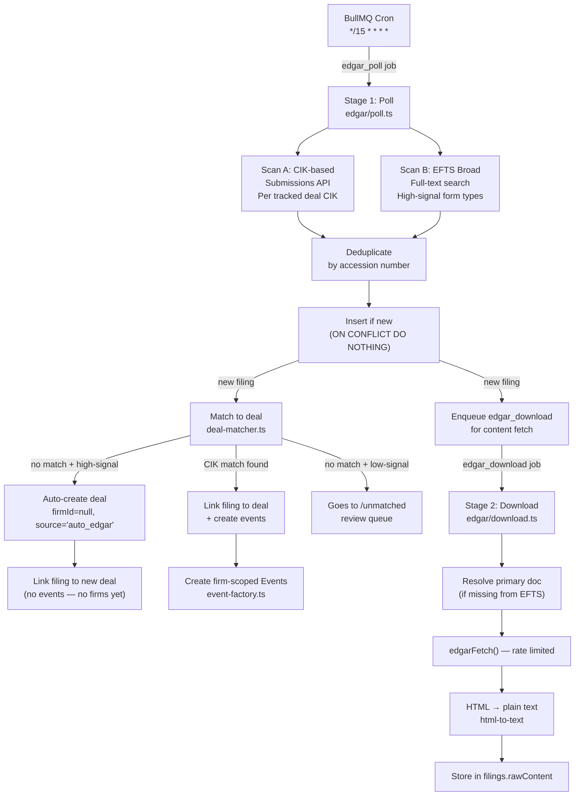
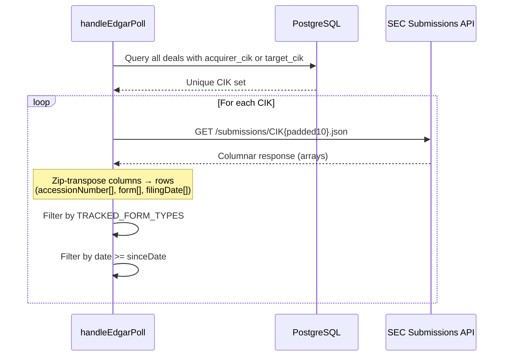
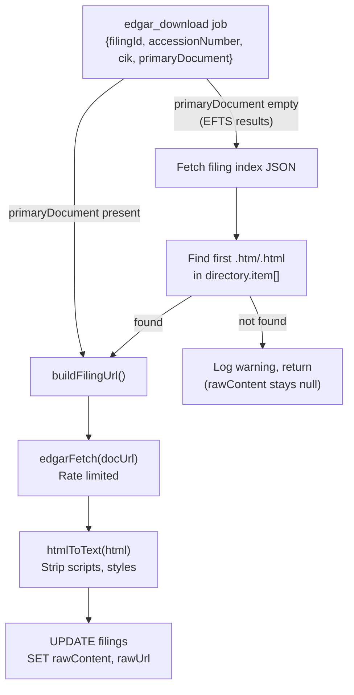
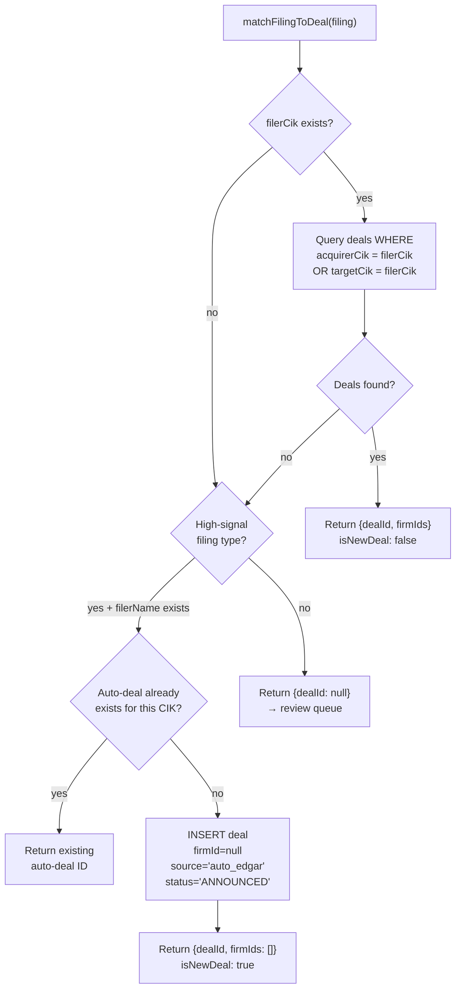
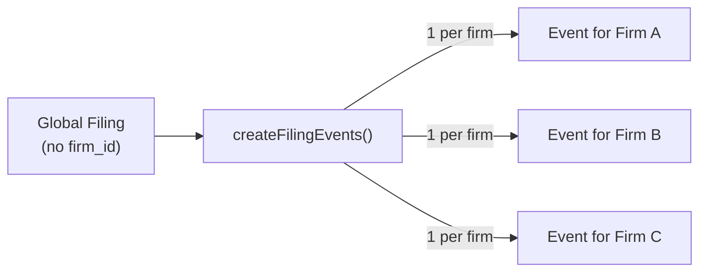
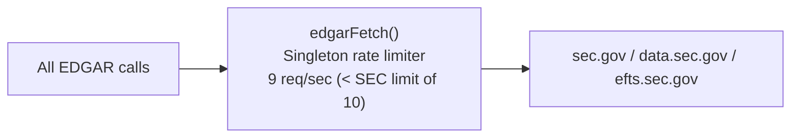
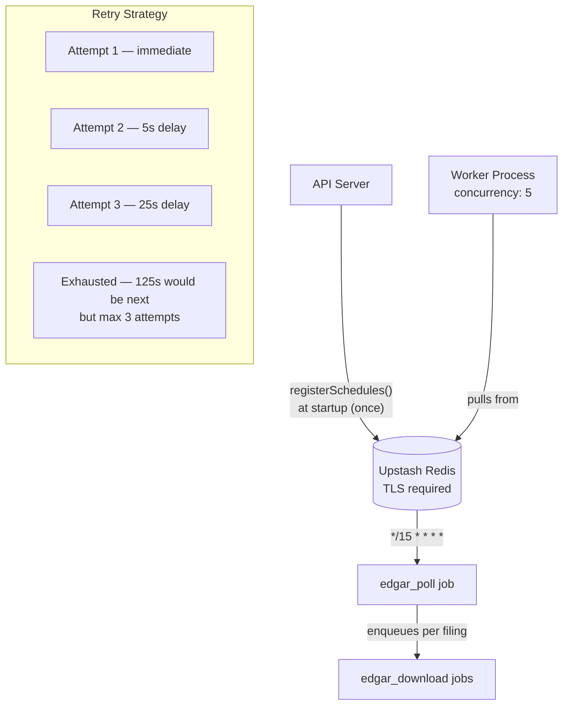

# EDGAR Ingestion Pipeline

## Overview
Two-stage background pipeline for ingesting SEC EDGAR filings: Stage 1 polls for new filings every 15 minutes, Stage 2 downloads and converts content. Auto-creates deals from high-signal filings (S-4, DEFM14A, PREM14A).

## Pipeline Flow

## Stage 1: Poll (`edgar/poll.ts`)

### Scan A: CIK-based poll

**Columnar response pitfall:** The Submissions API returns parallel arrays (`accessionNumber[]`, `form[]`, `filingDate[]`), NOT an array of objects. Must zip-transpose by index: `recent.accessionNumber[i]`, `recent.form[i]`, etc.

**CIK padding:** CIKs must be zero-padded to 10 digits for the URL: `CIK0000320193.json`

### Scan B: EFTS broad scan

Searches SEC full-text search for high-signal form types (S-4, DEFM14A, PREM14A) containing "merger agreement".

**EFTS gotcha:** Requires both `startdt` AND `enddt` parameters. Omitting either causes silent empty results.

**EFTS limitations:**
- `filerCik` and `primaryDocument` are often missing from EFTS results
- These are resolved during Stage 2 download via the filing index endpoint
- EFTS is a secondary mechanism; CIK-based poll is primary

### Cutoff date logic

- **First run** (no filings in DB): 30-day backfill
- **Subsequent runs**: Since the most recent filing date in DB
- Uses 1-hour overlap window (not 15 min) for safety

## Stage 2: Download (`edgar/download.ts`)

**Failure behavior:** If all 3 retries fail, the filing stays with `rawContent = null`. The UI shows "content pending" and the analyst can click the raw EDGAR link. This is acceptable — content is supplementary, not critical.

## Deal Matching (`edgar/deal-matcher.ts`)

**Auto-created deal properties:**
- `firmId = null` — invisible to firm-scoped RLS queries
- `source = 'auto_edgar'` — distinguishes from manually created deals
- `symbol = ''`, `target = ''` — unknown until analyst reviews
- `acquirer = filing.filerName` — best guess from metadata
- `status = 'ANNOUNCED'`

**No events for unclaimed deals:** When `firmIds` is empty (auto-created deal, no firm tracking it), the event factory returns early. Events only appear in firm Inboxes when a firm claims the deal.

## Event Factory (`edgar/event-factory.ts`)

Creates one Event per firm tracking the deal:

### Materiality Scores

| Filing Type | Score | Severity |
|---|---|---|
| S-4, DEFM14A | 80 | CRITICAL |
| SC TO-T, PREM14A, SC 14D9 | 70-75 | CRITICAL |
| 8-K | 60 | WARNING |
| SC 13D | 50 | WARNING |
| SC 13G | 40 | INFO |

Severity thresholds: >= 70 CRITICAL, >= 50 WARNING, < 50 INFO.

## Rate Limiting (`edgar/client.ts`)

**Mandatory:** ALL outbound EDGAR requests must go through `edgarFetch()`. Never call `fetch()` directly for EDGAR URLs.

**User-Agent required:** SEC Fair Access Policy mandates a User-Agent header. Currently `'j16z admin@j16z.com'`.

**Rate limiter:** Uses `limiter` package's `RateLimiter`. Module-level singleton — shared across all EDGAR calls in the process.

## Tracked Form Types

**High-signal (auto-create deals):** S-4, S-4/A, DEFM14A, PREM14A

**All tracked types:**
8-K, 8-K/A, S-4, S-4/A, DEFM14A, SC 13D, SC 13D/A, SC 13G, SC 13G/A, SC TO-T, SC TO-T/A, SC TO-I, SC TO-I/A, PREM14A, SC 14D9, SC 14D9/A

**SC TO naming gotcha:** "SC TO" is NOT a valid EDGAR form code. The actual codes are SC TO-T (third-party tender offer, primary M&A signal) and SC TO-I (issuer self-tender, lower signal).

## Queue Infrastructure

**Upstash TLS:** Connection requires `tls: {}` (empty object enables TLS). Forgetting this causes silent connection failures.

**Cost warning:** BullMQ polls Redis continuously. Use Upstash Fixed plan (not pay-as-you-go) during development to avoid surprise charges.

**Job retention:** 1000 completed, 5000 failed (for debugging/audit).
