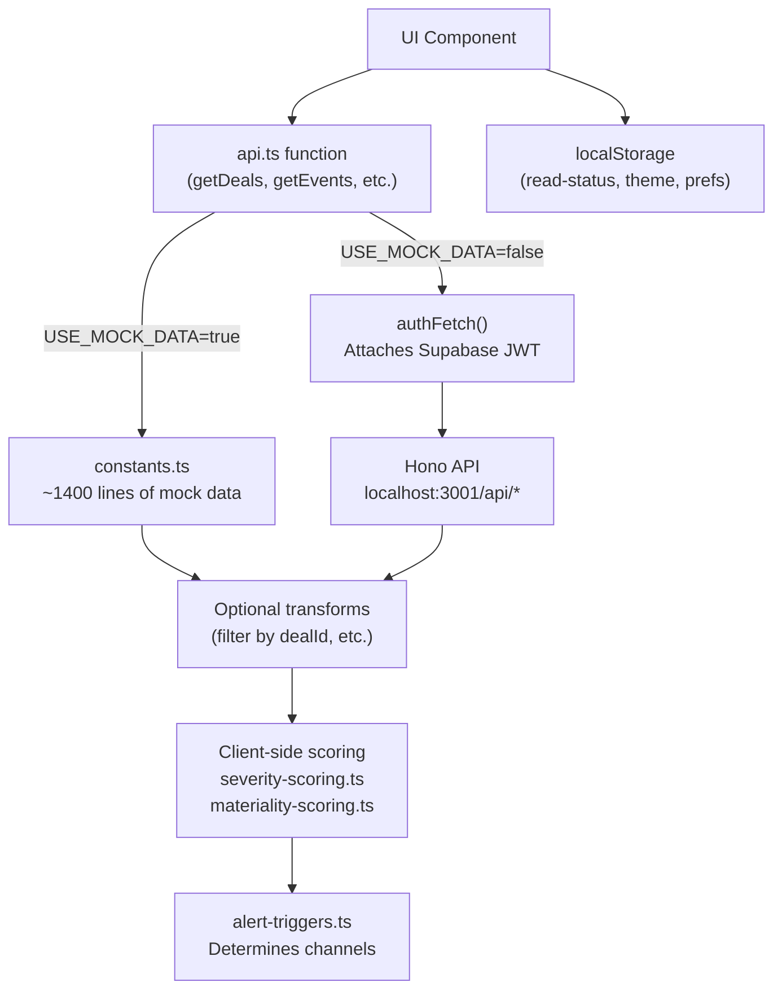
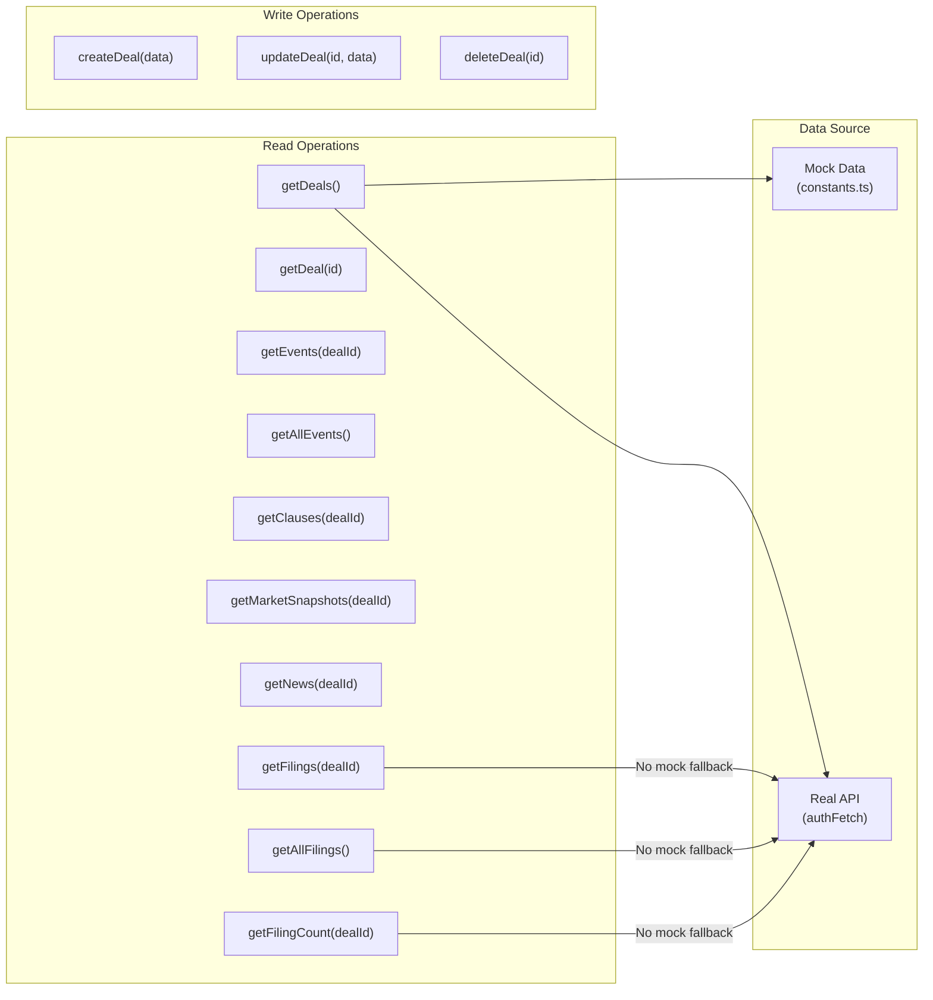
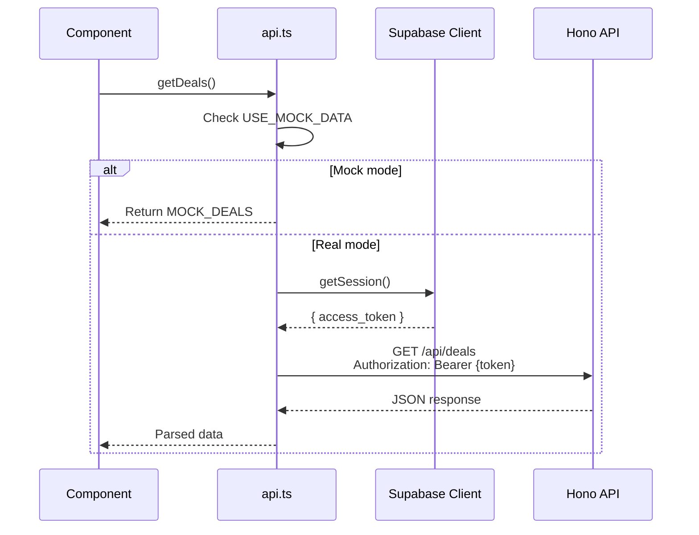
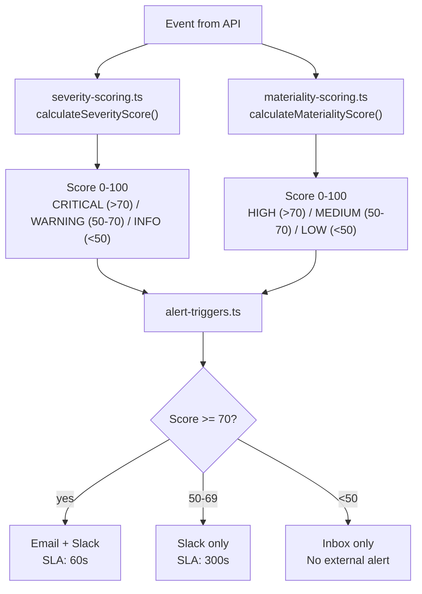
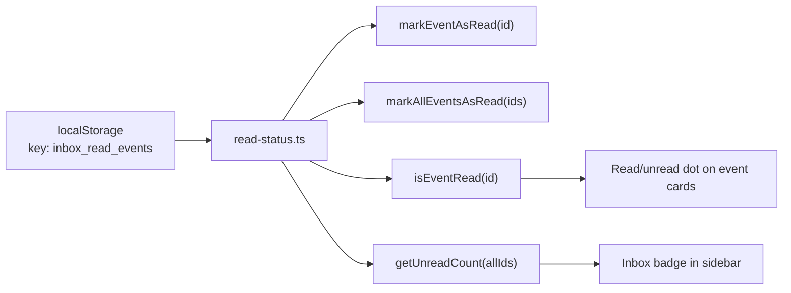
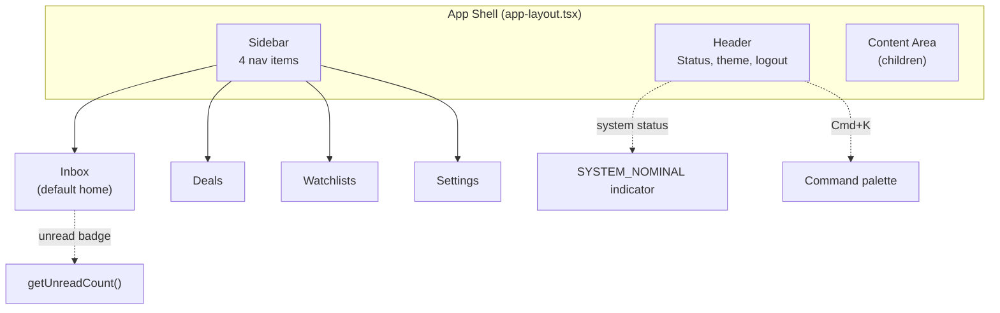

# Frontend Data Layer

## Overview
API abstraction layer (`src/lib/api.ts`) that switches between mock data and real backend calls via `NEXT_PUBLIC_USE_MOCK_DATA`. Client-side scoring, localStorage for read status and preferences. React Query and Zustand are installed but not yet used.

## Data Flow Architecture

## API Functions Map

**Filings are backend-only:** `getFilings()`, `getAllFilings()`, and `getFilingCount()` have no mock data fallback. They always call the real API. In mock mode, these return empty arrays / 0.

## authFetch Wrapper

**Gotcha:** If the Supabase session is expired, `authFetch` will send a request without a valid token, which will return 401 from the backend. The frontend doesn't currently handle token refresh failures in `authFetch` — the user sees an error and must re-login.

## Client-Side Scoring

### Severity Base Scores

| Type | SubType | Score |
|---|---|---|
| AGENCY | FTC Complaint | 95 |
| AGENCY | Second Request | 85 |
| AGENCY | DOJ Press Release | 80 |
| COURT | Injunction Granted | 90 |
| COURT | Motion Denied | 75 |
| FILING | S-4, DEFM14A | 80 |
| FILING | 8-K Amendment | 60 |
| SPREAD_MOVE | >200 bps | 70 |
| SPREAD_MOVE | >100 bps | 50 |
| NEWS | - | 10-40 |

### Adjustments (applied on top of base)

| Condition | Adjustment |
|---|---|
| <30 days to outside_date | +20 |
| p_close < 40% | +15 |
| litigation > 3 cases | +10 |
| Analyst marked "not_critical" | -25 |

**Important:** These scores are calculated client-side. The backend's `event-factory.ts` also assigns `materiality_score` and `severity` on event creation, but the frontend recalculates using its own logic. The two systems use similar but not identical base scores.

## Read/Unread Status

**Client-only:** Read status is stored only in localStorage, not synced to the database. Clearing browser data resets all events to unread. Different devices/browsers have independent read states.

**Custom event:** When read status changes, a `inbox:unread-updated` CustomEvent is dispatched on `window` so the sidebar badge updates in real-time without polling.

## State Management Status

| Tool | Status | Usage |
|---|---|---|
| `@tanstack/react-query` v5 | Installed, **not used** | No `useQuery`/`useMutation` calls found |
| `zustand` v5 | Installed, **not used** | No stores created |
| `use-local-storage-state` | **Active** | Theme, read status, preferences |
| Direct `api.ts` calls | **Active** | All data fetching is inline in components |

**Implication:** There's no query caching, deduplication, or background refetching. Each component that calls `getDeals()` makes a separate network request. This is fine for MVP but will need React Query integration as the app scales.

## Mock Data Inventory

| Constant | Count | Notes |
|---|---|---|
| `MOCK_DEALS` | ~50 deals | Real M&A transactions with full financial data |
| `MOCK_EVENTS` | ~11 events | Mix of all 5 event types |
| `MOCK_CLAUSES` | ~8 clauses | Termination fees, MAE, regulatory efforts |
| `MOCK_MARKET_SNAPSHOTS` | ~180 points | 6 months daily data for deal-1 |
| `MOCK_NEWS` | ~4 items | Law firm alerts, analyst notes |

**No mock filings:** Filing data is always fetched from the real backend, even in mock mode.

## Navigation & App Shell

The sidebar shows an unread count badge computed from `getAllEvents()` + `getReadEvents()` on mount and updated via the `inbox:unread-updated` custom event.
