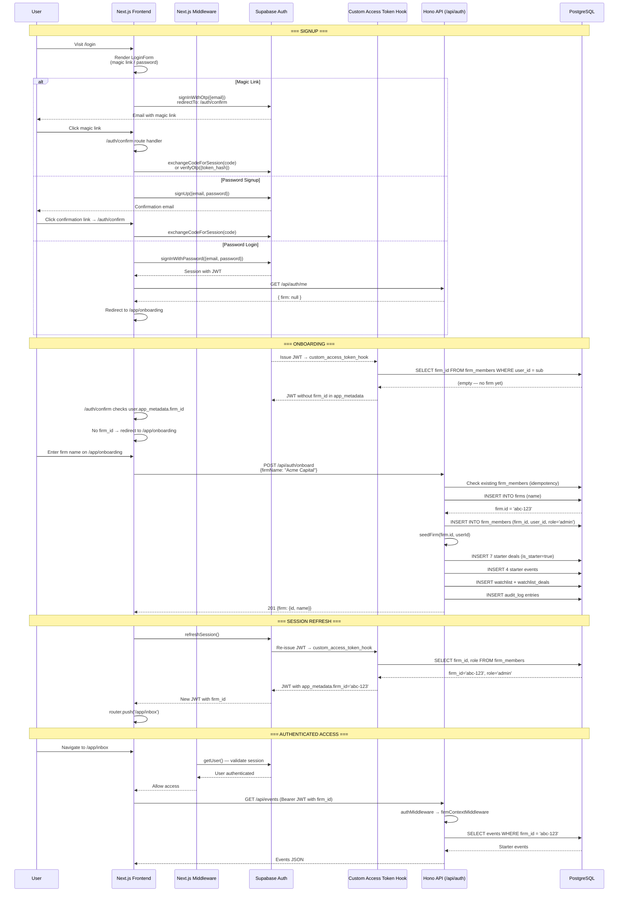
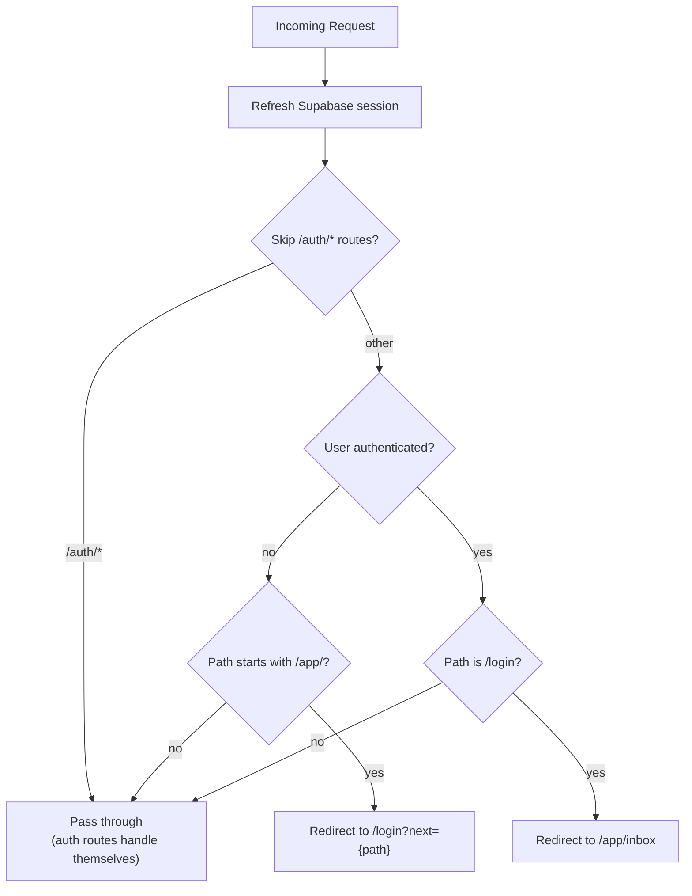
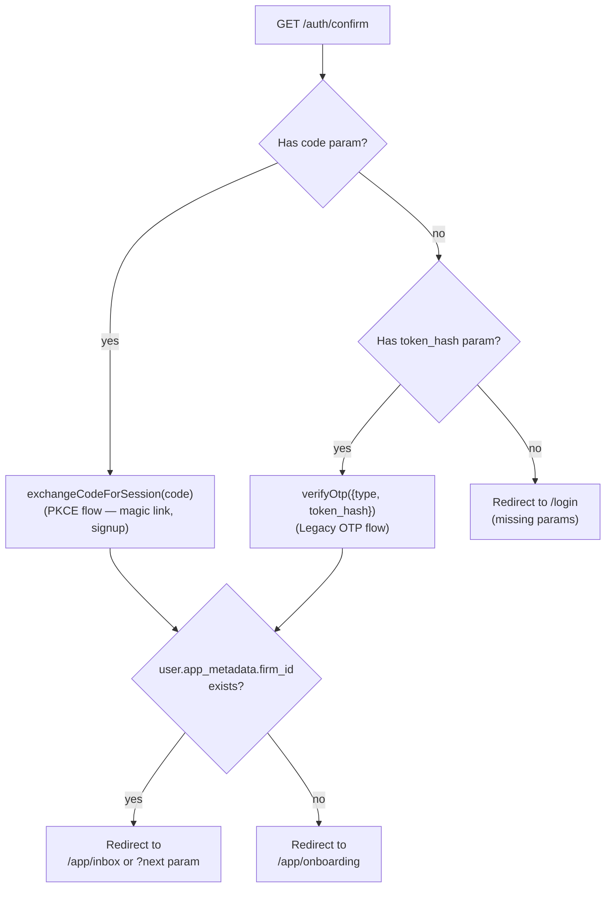
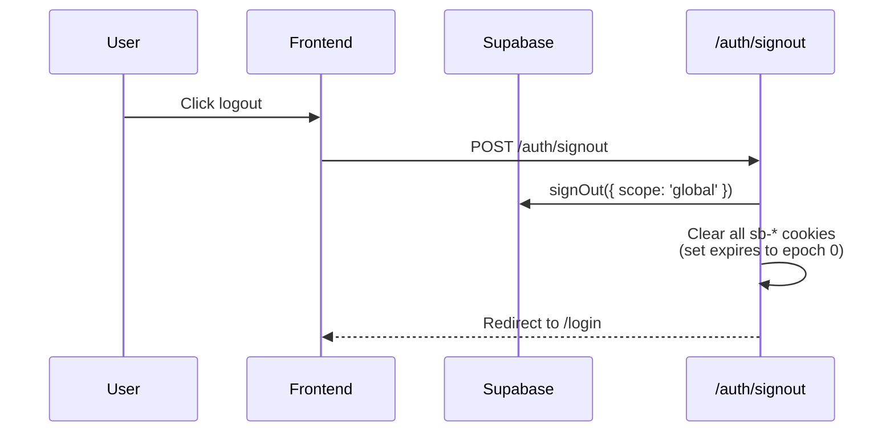
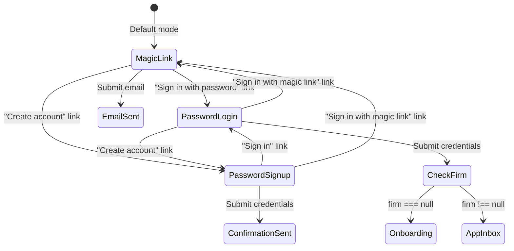
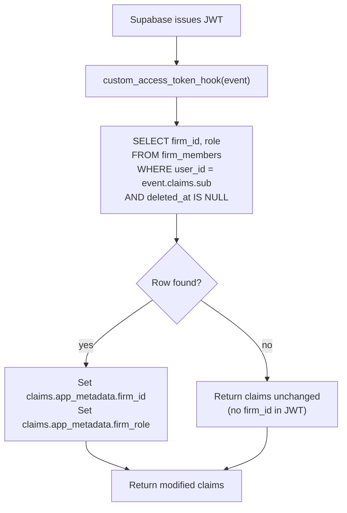
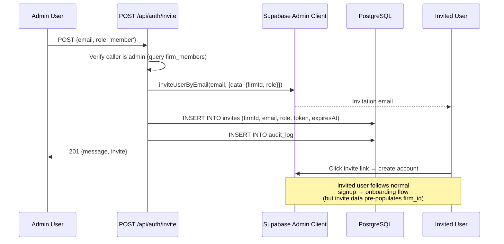

# Onboarding Flow

## Overview
End-to-end flow from Supabase signup to firm creation, deal seeding, JWT refresh, and authenticated app access. Spans Next.js middleware, Supabase Auth, the Hono API, and a Custom Access Token Hook.

## Complete Flow

## Next.js Middleware Route Protection

**Key behavior:** The middleware refreshes the Supabase session on EVERY request. This keeps tokens fresh and prevents stale sessions. The `?next=` parameter preserves the user's intended destination through the login flow.

## Auth Confirm Route Handler (`/auth/confirm`)

## Sign Out Flow

**`scope: 'global'`** signs out from all devices/sessions, not just the current one.

## Login Form Modes

## Custom Access Token Hook

The hook is a PostgreSQL function that runs every time Supabase issues a JWT:

**Deployment requirement:** This hook must be enabled in the Supabase Dashboard under Authentication → Hooks → Custom Access Token Hook. Without it:
- No JWT will ever contain `firm_id`
- All data route requests will get 403 from `firmContextMiddleware`
- The app will be stuck in an infinite onboarding loop

**Timing gotcha:** After `POST /api/auth/onboard` creates the firm_members record, the frontend MUST call `supabase.auth.refreshSession()` to get a new JWT with the firm_id injected. Without this refresh, the old JWT (without firm_id) would still be used and data routes would 403.

## Invite Flow (Post-Onboarding)

**Gotcha:** The invite endpoint uses `firmContextMiddleware`? No — it's under `/api/auth/*` which skips firm context. It manually queries `firm_members` to find the caller's firm and verify admin role. This is correct because the endpoint needs to work the same whether or not the JWT has firm_id.
