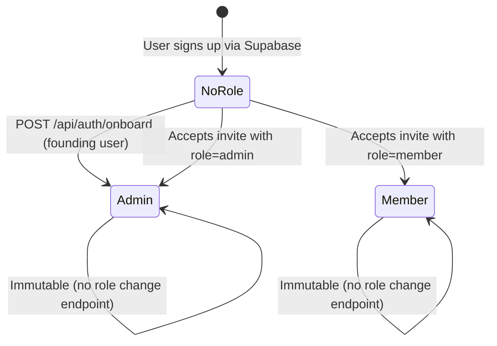
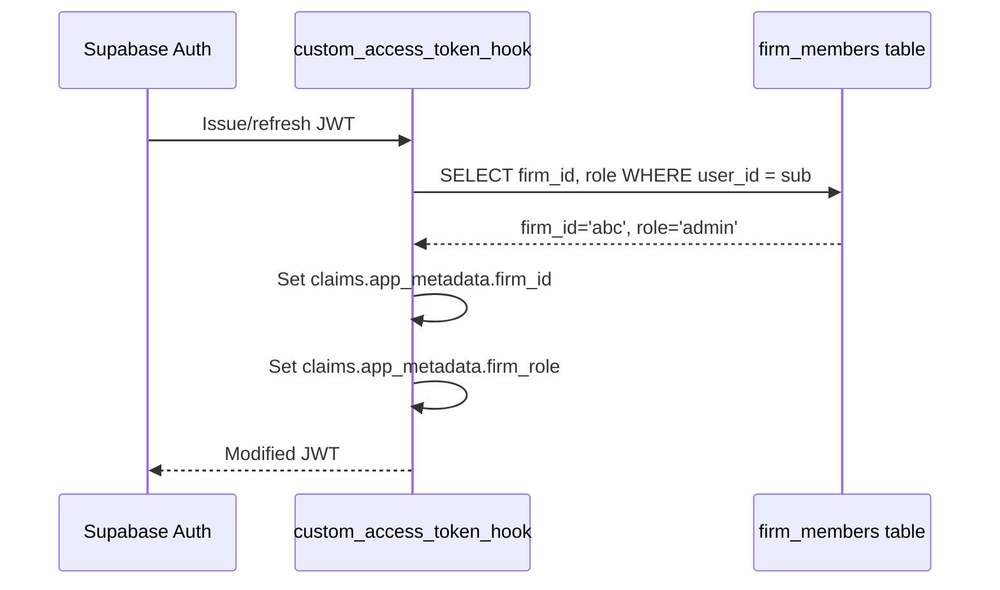
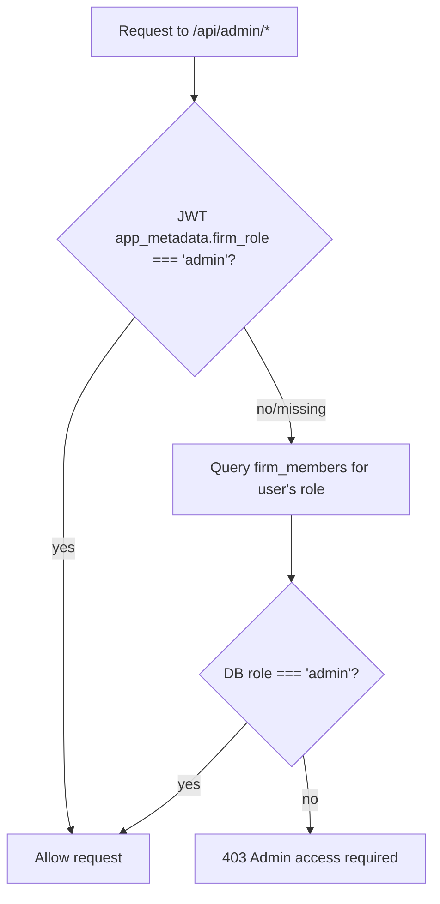
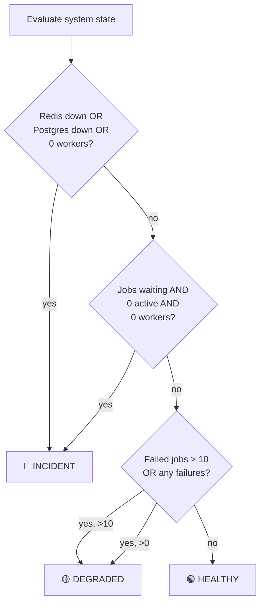
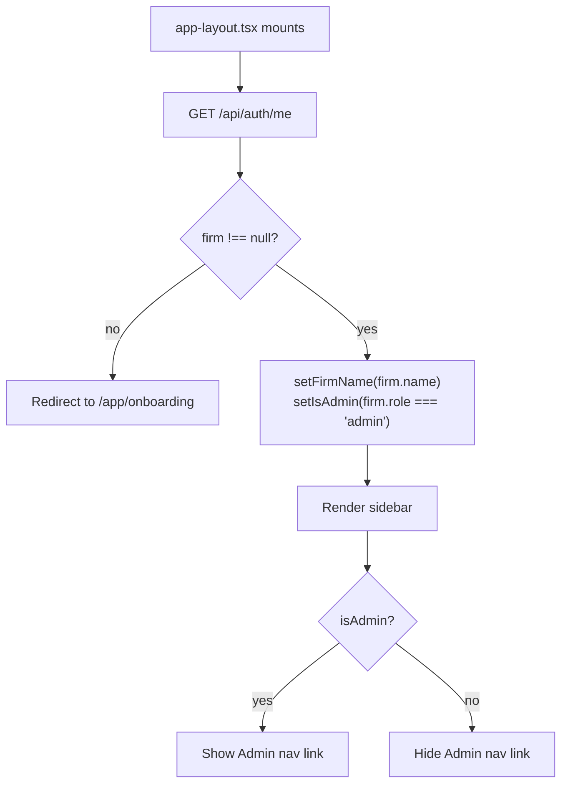

# Role System & Admin Panel

## Overview
Two-role system (`admin` | `member`) enforced at JWT, middleware, and DB layers. Admin panel provides pipeline monitoring, deal freshness tracking, and system health for operators. Roles are assigned at onboarding (founder = admin) and invites.

## Role Lifecycle

Roles are set once and cannot be changed via API. The `firm_members.role` column stores `'admin'` or `'member'` as text.

## Role Injection into JWT

The hook is a Postgres function deployed via migration (`20260301000004_access_token_hook.sql`). It must be **manually enabled** in Supabase Dashboard → Authentication → Hooks.

## Middleware Stack (with Admin Layer)

```mermaid
graph TD
    subgraph "All /api/* routes"
        AUTH["authMiddleware<br/>JWT verification"]
    end

    subgraph "Data routes"
        FIRM["firmContextMiddleware<br/>Extracts firm_id"]
    end

    subgraph "Admin routes"
        ADMIN["adminMiddleware<br/>Requires admin role"]
    end

    AUTH --> DEALS["/api/deals/*"]
    AUTH --> EVENTS["/api/events/*"]
    AUTH --> FILINGS["/api/filings/*"]
    AUTH --> WATCHLISTS["/api/watchlists/*"]
    AUTH --> MEMOS["/api/memos/*"]
    AUTH --> AUTH_ROUTES["/api/auth/*"]
    AUTH --> ADMIN_ROUTES["/api/admin/*"]

    FIRM --> DEALS
    FIRM --> EVENTS
    FIRM --> FILINGS
    FIRM --> WATCHLISTS
    FIRM --> MEMOS

    ADMIN --> ADMIN_ROUTES

    style AUTH_ROUTES fill:#2d4a2d,stroke:#4a7a4a
    style ADMIN_ROUTES fill:#2d2d4a,stroke:#4a4a7a
    style DEALS fill:#4a2d2d,stroke:#7a4a4a
    style EVENTS fill:#4a2d2d,stroke:#7a4a4a
    style FILINGS fill:#4a2d2d,stroke:#7a4a4a
    style WATCHLISTS fill:#4a2d2d,stroke:#7a4a4a
    style MEMOS fill:#4a2d2d,stroke:#7a4a4a
```

Green = auth only. Red = auth + firmContext. Blue = auth + admin.

## Admin Middleware — Dual Verification

The DB fallback exists because the Custom Access Token Hook requires manual Dashboard activation. If the hook isn't enabled, `firm_role` is absent from the JWT, but the DB still has the correct role. This prevents admin lockout during setup.

File: `apps/api/src/middleware/admin.ts`

## Admin API Endpoints

| Endpoint | Purpose | Key Data |
|---|---|---|
| `GET /api/admin/system` | System health + derived state | `state: healthy/degraded/incident`, silent failure detection, infra connectivity |
| `GET /api/admin/queues` | BullMQ queue stats | Job counts by state, recent failed jobs, registered schedulers |
| `GET /api/admin/schedules` | Cron schedule config | All 10 schedules with cron patterns, next run times |
| `GET /api/admin/ingestion` | Source health | Per-source last sync, errors, items ingested (from `ingestion_status` table) |
| `GET /api/admin/overview` | Firm stats | Member, deal, event, filing counts |
| `GET /api/admin/pipeline` | Pipeline health | Funnel (discovered→downloaded→extracted→events), deal freshness, failure groups |

## System State Derivation

The **silent failure** pattern is the most dangerous state: jobs are queued but no workers are processing them. Nothing errors out — data just stops flowing. The admin panel auto-surfaces this with a red alert banner.

## Pipeline Funnel

```mermaid
graph LR
    A["Discovered<br/>(filings table)"] -->|downloaded?| B["Downloaded<br/>(rawContent != null)"]
    B -->|extracted?| C["Extracted<br/>(extracted = true)"]
    C -->|event created?| D["Events Created<br/>(events table)"]

    style A fill:#1a1a2e,stroke:#4a4a7a
    style B fill:#1a1a2e,stroke:#4a4a7a
    style C fill:#1a1a2e,stroke:#4a4a7a
    style D fill:#1a1a2e,stroke:#4a4a7a
```

Count drops between stages indicate blockages. The admin panel highlights gaps >15% in red.

## Deal Freshness Tracking

Each tracked deal shows the timestamp of its most recent event. Freshness levels:

| Freshness | Condition | Indicator |
|---|---|---|
| Fresh | Event within 24h | 🟢 Green |
| Aging | No event in 24-48h | 🟡 Amber |
| Stale | No event in 48h+ OR never | 🔴 Red |

Stale deals sort to the top of the admin panel. For an M&A pipeline, stale data on an active deal is the highest-priority incident — a filing could have been missed.

## Frontend Role Gate

The firm check and role detection happen in `app-layout.tsx` on mount (client-side), not in Next.js middleware. This is because the middleware can't reliably check `firm_role` — the JWT hook may not be enabled in Dashboard.

## What Admins Can vs Can't Do

| Action | Admin | Member |
|---|---|---|
| View all deal data | ✅ | ✅ |
| Create/edit deals | ✅ | ✅ |
| Create memos | ✅ | ✅ |
| Invite team members | ✅ | ❌ |
| View admin panel | ✅ | ❌ |
| View system health | ✅ | ❌ |
| View pipeline status | ✅ | ❌ |
| Change user roles | ❌ (no endpoint) | ❌ |
| Delete firm | ❌ (no endpoint) | ❌ |

Role enforcement is minimal by design — both roles have equal data access within a firm. The admin distinction only gates team management and system monitoring.
