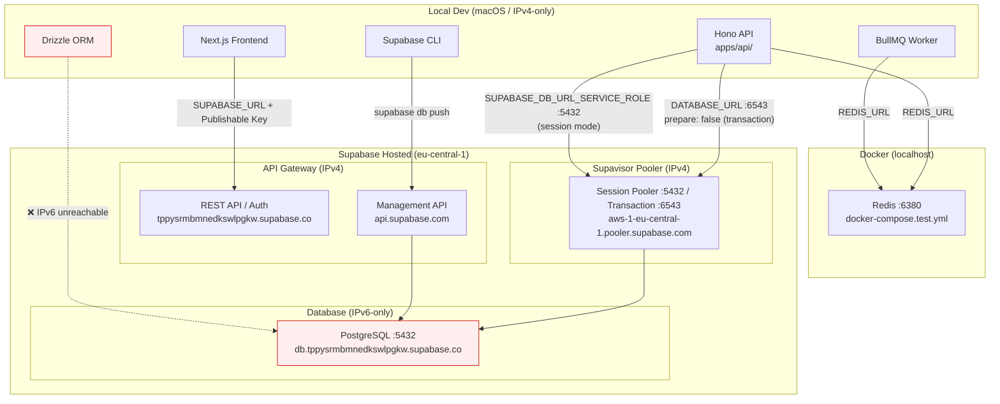
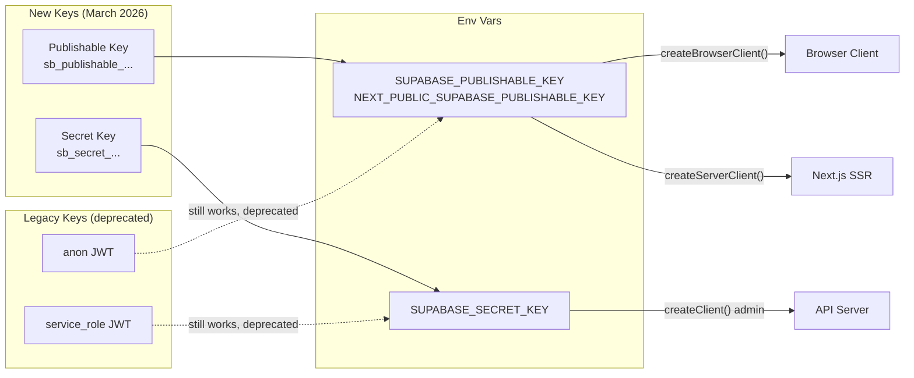
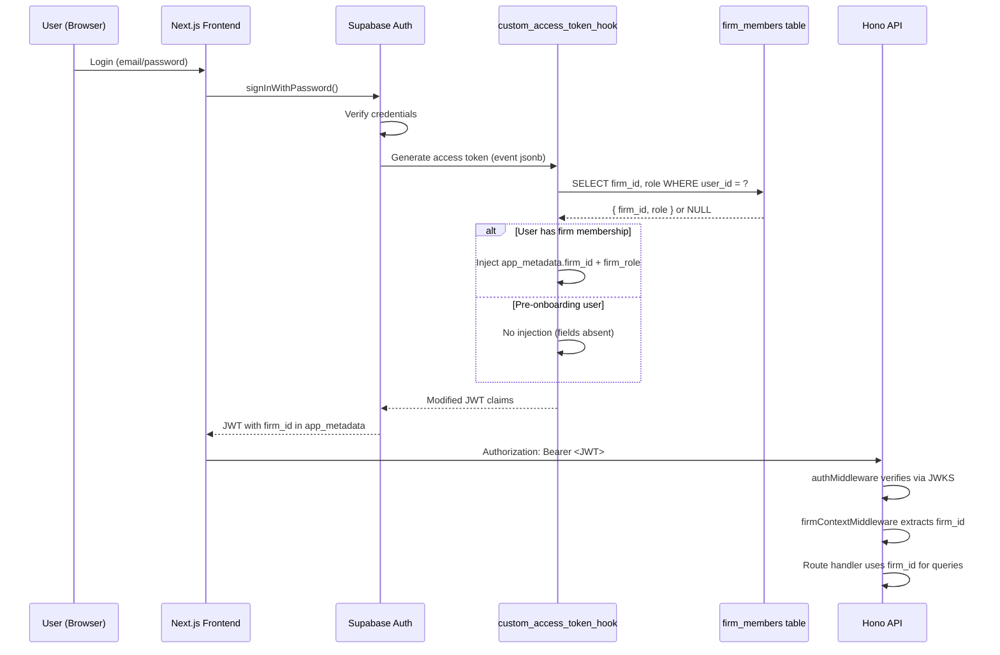
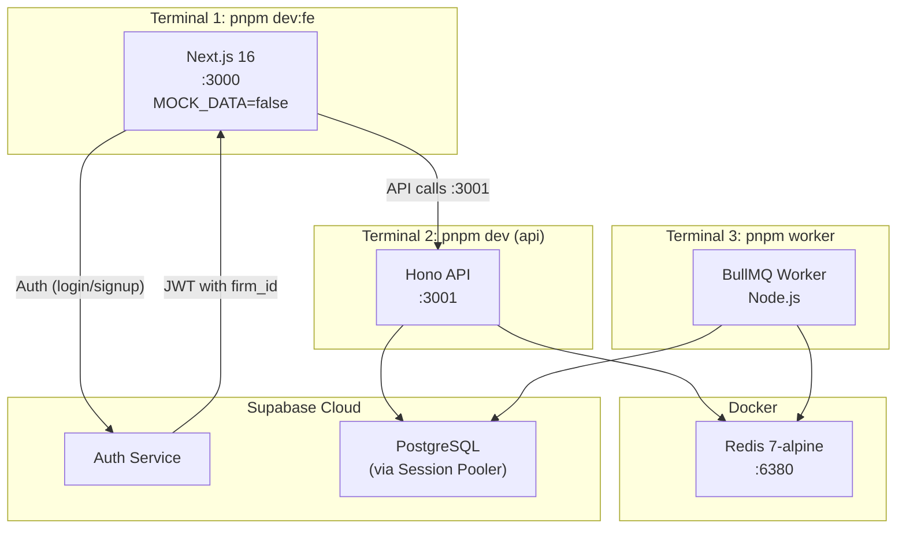
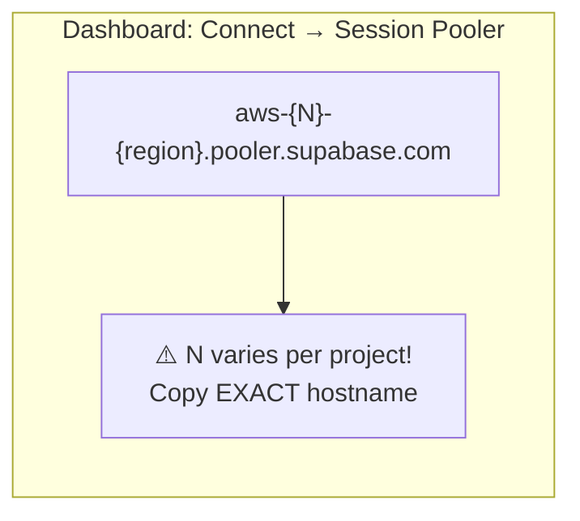
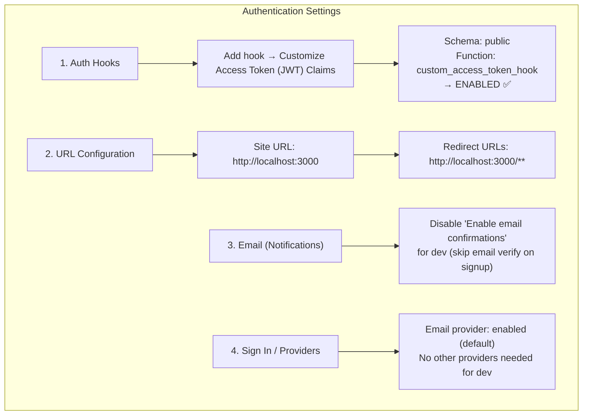

# Supabase Infrastructure

## Overview
j16z uses hosted Supabase (eu-central-1) for auth + Postgres, Docker Redis for BullMQ. Supabase's direct DB connection is IPv6-only; all local dev and CI must route through the Session Pooler (IPv4) or Supabase CLI (Management API). New API key format (`sb_publishable_`/`sb_secret_`) replaced legacy JWT-based `anon`/`service_role` keys.

## Connection Architecture



### Key Gotchas

- **Direct connection (`db.xxx.supabase.co:5432`) is IPv6-only** on free tier. `drizzle-kit migrate` will fail with `EHOSTUNREACH` on macOS.
- **Workaround for migrations:** Copy SQL from `apps/api/drizzle/*.sql` → `supabase/migrations/` with timestamp prefixes, then `supabase db push --linked`. Routes through Management API (IPv4).
- **Runtime DB access:** Use Session Pooler (`aws-0-eu-central-1.pooler.supabase.com:5432`) in `DATABASE_URL` and `SUPABASE_DB_URL_SERVICE_ROLE`. Must use `prepare: false` in transaction mode (port 6543), session mode (port 5432) supports prepared statements.
- **`NODE_OPTIONS="--dns-result-order=ipv4first"`** does NOT fix the IPv6 issue — the host literally has no A record.
- **Pooler hostname prefix varies per project.** Our project uses `aws-1-eu-central-1`, NOT `aws-0-eu-central-1`. Using the wrong prefix gives "Tenant or user not found". Always copy the exact hostname from Dashboard → Connect → Session Pooler. ([GitHub Discussion #30107](https://github.com/orgs/supabase/discussions/30107))
- **Pooler hostname is NOT always `aws-0`!** Our project uses `aws-1-eu-central-1.pooler.supabase.com`. Using `aws-0` gives "Tenant or user not found". **Always copy the exact hostname from Dashboard → Connect → Session Pooler.** (See [GitHub Discussion #30107](https://github.com/orgs/supabase/discussions/30107))

## API Key Architecture



### Key Differences

| Property | Publishable (`sb_publishable_`) | Secret (`sb_secret_`) |
|----------|-------------------------------|----------------------|
| Client-safe? | Yes | No — blocked by API Gateway in browsers |
| RLS | Respects RLS (anon/authenticated role) | Bypasses RLS (service_role) |
| Rotation | Independent, instant, no downtime | Independent, instant |
| Format | Short opaque string | Short opaque string |
| Legacy equiv | `anon` JWT | `service_role` JWT |

## Auth Flow with Access Token Hook



### Hook Deployment Checklist

1. SQL function deployed via `supabase db push` (file: `apps/api/src/db/migrations/custom_access_token_hook.sql`)
2. **Must enable in Dashboard:** Authentication → Hooks → Custom Access Token Hook → Enable → Select `public.custom_access_token_hook`
3. Without enabling in Dashboard, the function exists but Supabase won't call it — JWTs will lack `firm_id`
4. Function has `SECURITY DEFINER` — runs as owner, not caller. Granted to `supabase_auth_admin` only.

## Local Dev Stack



### Startup Sequence

```bash
# 1. Start Redis (Docker must be running)
pnpm infra:up

# 2. Start API server
cd apps/api && pnpm dev

# 3. Start worker (separate terminal)
cd apps/api && pnpm worker

# 4. Start frontend (separate terminal)
cd apps/j16z-frontend && pnpm dev

# Or use the orchestrated script (steps 1-3):
pnpm dev:be
```

### Environment Files

| File | Contains | Points to |
|------|----------|-----------|
| `apps/api/.env` | All backend env vars | Supabase cloud + local Redis |
| `apps/j16z-frontend/.env.local` | Frontend env vars | Supabase cloud + local API |
| `apps/langextract/.env` | Python worker env | Same DB + Redis as API |

## Setting Up a New Supabase Project (from scratch)

Complete checklist for setting up Supabase for j16z. This covers everything — DB, auth, hooks, email, URLs.

### 1. Create Project

1. Go to [supabase.com/dashboard](https://supabase.com/dashboard)
2. **New Project** → pick org, name `j16z`, region (eu-central-1 recommended), set DB password
3. Wait for project to finish provisioning (~1 min)

### 2. Get Credentials

From **Settings → API Keys**:
- Copy **Publishable key** (`sb_publishable_...`)
- Copy **Secret key** (`sb_secret_...`) — click eye icon to reveal

From the **Connect** button (top bar) → **Connection String** tab:
- Switch Method to **"Session Pooler"** → copy the hostname
- **CRITICAL:** Note the `aws-N` prefix — it's NOT always `aws-0`. Our project uses `aws-1-eu-central-1`



### 3. Configure .env Files

**`apps/api/.env`:**
```env
PORT=3001
DATABASE_URL=postgresql://postgres.{ref}:{password}@{pooler-host}:6543/postgres
SUPABASE_URL=https://{ref}.supabase.co
SUPABASE_PUBLISHABLE_KEY=sb_publishable_...
SUPABASE_SECRET_KEY=sb_secret_...
SUPABASE_DB_URL_SERVICE_ROLE=postgresql://postgres.{ref}:{password}@{pooler-host}:5432/postgres
FRONTEND_URL=http://localhost:3000
REDIS_URL=redis://localhost:6380
```

**`apps/j16z-frontend/.env.local`:**
```env
NEXT_PUBLIC_USE_MOCK_DATA=false
NEXT_PUBLIC_SUPABASE_URL=https://{ref}.supabase.co
NEXT_PUBLIC_SUPABASE_PUBLISHABLE_KEY=sb_publishable_...
NEXT_PUBLIC_API_URL=http://localhost:3001
```

> **Password encoding:** URL-encode special chars in the password. `!` → `%21`, `@` → `%40`, `#` → `%23`.

### 4. Push Database Schema

```bash
# Install & authenticate Supabase CLI
brew install supabase/tap/supabase
supabase login                                    # Opens browser for OAuth
supabase init                                     # Creates supabase/ dir (if not exists)
supabase link --project-ref {your-project-ref}    # Link to project

# Copy Drizzle migrations to Supabase format
cp apps/api/drizzle/0000_*.sql supabase/migrations/20260301000000_initial.sql
cp apps/api/drizzle/0001_*.sql supabase/migrations/20260301000001_second.sql
cp apps/api/drizzle/0002_*.sql supabase/migrations/20260301000002_third.sql
cp apps/api/drizzle/0003_*.sql supabase/migrations/20260301000003_fourth.sql

# Push access token hook
cp apps/api/src/db/migrations/custom_access_token_hook.sql supabase/migrations/20260301000004_hook.sql

# Apply all migrations (routes through Management API — IPv4 compatible)
supabase db push --linked
```

### 5. Dashboard Configuration



#### Step-by-step:

**Auth Hooks** (Authentication → Auth Hooks):
1. Click **Add hook** → **Customize Access Token (JWT) Claims hook**
2. Type: **Postgres function**
3. Schema: `public`
4. Function: `custom_access_token_hook`
5. Save — should show **ENABLED** ✅
6. Without this, JWTs won't contain `firm_id` and all API data routes will return 403

**URL Configuration** (Authentication → URL Configuration):
1. Site URL: `http://localhost:3000`
2. Redirect URLs: add `http://localhost:3000/**`
3. Save — needed for auth redirects after email confirm/magic links

**Email** (Authentication → Email under NOTIFICATIONS):
1. For dev: **Disable email confirmations** → users can sign up and login immediately without clicking a confirmation link
2. Supabase built-in email works on free tier (4 emails/hour) — no SMTP setup needed for dev
3. For production: re-enable confirmations and configure custom SMTP (Resend, Postmark, etc.)

**Sign In / Providers** (Authentication → Sign In / Providers):
1. Email provider should be enabled by default
2. No other providers needed for local dev

### 6. Supabase MCP (optional)

Add to `~/.config/opencode/opencode.json`:
```json
{
  "mcp": {
    "supabase": {
      "type": "remote",
      "url": "https://mcp.supabase.com/mcp?project_ref={your-project-ref}",
      "enabled": true
    }
  }
}
```
Then authenticate: `opencode mcp auth supabase`

### 7. Verify Everything Works

```bash
# 1. Test DB connection via pooler
PGPASSWORD='{password}' psql "postgresql://postgres.{ref}@{pooler-host}:5432/postgres" \
  -c "SELECT count(*) FROM information_schema.tables WHERE table_schema = 'public';"
# Expected: 16 tables

# 2. Test access token hook exists
PGPASSWORD='{password}' psql "postgresql://postgres.{ref}@{pooler-host}:5432/postgres" \
  -c "SELECT proname FROM pg_proc WHERE proname = 'custom_access_token_hook';"
# Expected: 1 row

# 3. Start the stack
pnpm infra:up              # Docker Redis
cd apps/api && pnpm dev     # API on :3001
cd apps/api && pnpm worker  # BullMQ worker (separate terminal)
cd apps/j16z-frontend && pnpm dev  # Frontend on :3000

# 4. Verify health
curl http://localhost:3001/health
# Expected: {"status":"ok","timestamp":"..."}

# 5. Sign up via http://localhost:3000 → creates user → onboard → auto-seeds deals
```

### Troubleshooting

| Symptom | Cause | Fix |
|---------|-------|-----|
| `EHOSTUNREACH` on migrations | Direct DB host is IPv6-only | Use `supabase db push --linked` (Management API, IPv4) |
| `Tenant or user not found` on pooler | Wrong `aws-N` prefix | Copy exact hostname from Dashboard → Connect → Session Pooler |
| API returns 403 on all data routes | Access token hook not enabled | Dashboard → Auth Hooks → enable `custom_access_token_hook` |
| Signup fails silently | Email confirmation enabled | Disable in Dashboard → Email → uncheck "Enable email confirmations" |
| JWT missing `firm_id` | User hasn't onboarded yet | Complete onboarding flow at `/app/onboarding` — creates firm + membership |
| `prepare: false` errors | Using transaction pooler (port 6543) | Expected — transaction mode doesn't support prepared statements, Drizzle is configured correctly |
