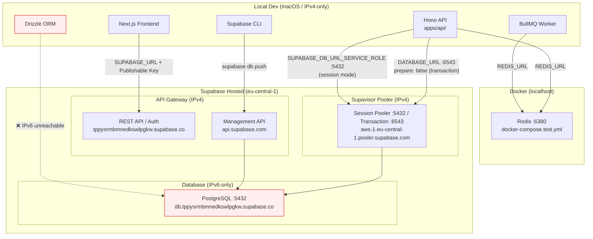
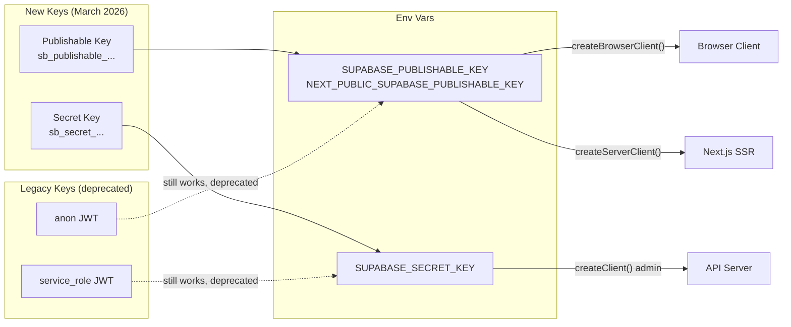
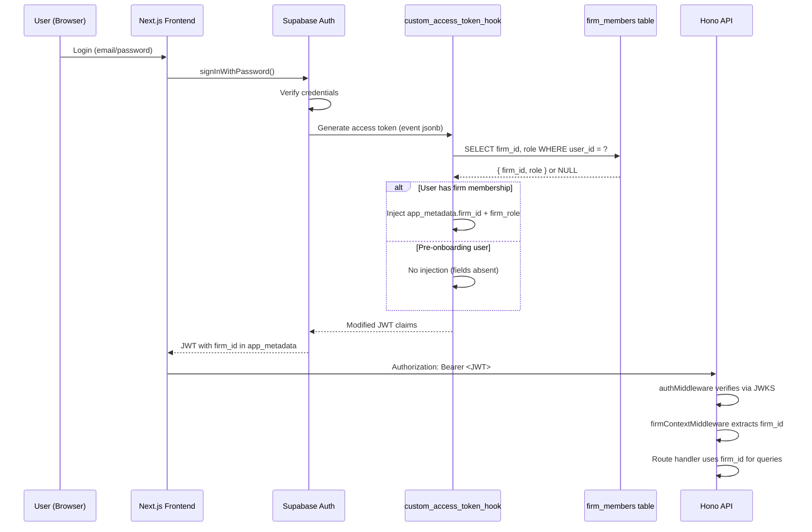
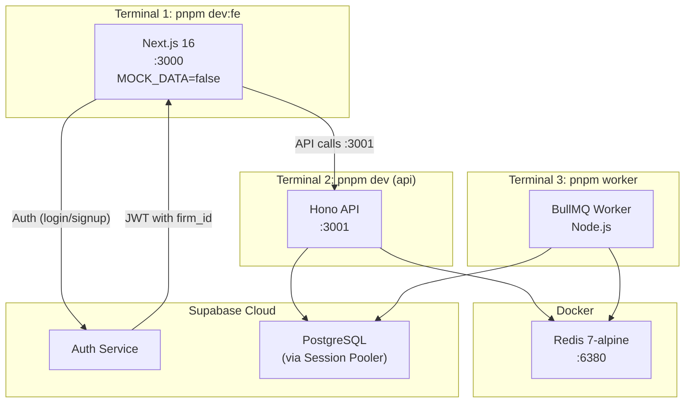

# Supabase Infrastructure

## Overview
j16z uses hosted Supabase (eu-central-1) for auth + Postgres, Docker Redis for BullMQ. Supabase's direct DB connection is IPv6-only; all local dev and CI must route through the Session Pooler (IPv4) or Supabase CLI (Management API). New API key format (`sb_publishable_`/`sb_secret_`) replaced legacy JWT-based `anon`/`service_role` keys.

## Connection Architecture



### Key Gotchas

- **Direct connection (`db.xxx.supabase.co:5432`) is IPv6-only** on free tier. `drizzle-kit migrate` will fail with `EHOSTUNREACH` on macOS.
- **Workaround for migrations:** Copy SQL from `apps/api/drizzle/*.sql` → `supabase/migrations/` with timestamp prefixes, then `supabase db push --linked`. Routes through Management API (IPv4).
- **Runtime DB access:** Use Session Pooler (`aws-0-eu-central-1.pooler.supabase.com:5432`) in `DATABASE_URL` and `SUPABASE_DB_URL_SERVICE_ROLE`. Must use `prepare: false` in transaction mode (port 6543), session mode (port 5432) supports prepared statements.
- **`NODE_OPTIONS="--dns-result-order=ipv4first"`** does NOT fix the IPv6 issue — the host literally has no A record.
- **Pooler hostname prefix varies per project.** Our project uses `aws-1-eu-central-1`, NOT `aws-0-eu-central-1`. Using the wrong prefix gives "Tenant or user not found". Always copy the exact hostname from Dashboard → Connect → Session Pooler. ([GitHub Discussion #30107](https://github.com/orgs/supabase/discussions/30107))
- **Pooler hostname is NOT always `aws-0`!** Our project uses `aws-1-eu-central-1.pooler.supabase.com`. Using `aws-0` gives "Tenant or user not found". **Always copy the exact hostname from Dashboard → Connect → Session Pooler.** (See [GitHub Discussion #30107](https://github.com/orgs/supabase/discussions/30107))

## API Key Architecture



### Key Differences

| Property | Publishable (`sb_publishable_`) | Secret (`sb_secret_`) |
|----------|-------------------------------|----------------------|
| Client-safe? | Yes | No — blocked by API Gateway in browsers |
| RLS | Respects RLS (anon/authenticated role) | Bypasses RLS (service_role) |
| Rotation | Independent, instant, no downtime | Independent, instant |
| Format | Short opaque string | Short opaque string |
| Legacy equiv | `anon` JWT | `service_role` JWT |

## Auth Flow with Access Token Hook



### Hook Deployment Checklist

1. SQL function deployed via `supabase db push` (file: `apps/api/src/db/migrations/custom_access_token_hook.sql`)
2. **Must enable in Dashboard:** Authentication → Hooks → Custom Access Token Hook → Enable → Select `public.custom_access_token_hook`
3. Without enabling in Dashboard, the function exists but Supabase won't call it — JWTs will lack `firm_id`
4. Function has `SECURITY DEFINER` — runs as owner, not caller. Granted to `supabase_auth_admin` only.

## Local Dev Stack



### Startup Sequence

```bash
# 1. Start Redis (Docker must be running)
pnpm infra:up

# 2. Start API server
cd apps/api && pnpm dev

# 3. Start worker (separate terminal)
cd apps/api && pnpm worker

# 4. Start frontend (separate terminal)
cd apps/j16z-frontend && pnpm dev

# Or use the orchestrated script (steps 1-3):
pnpm dev:be
```

### Environment Files

| File | Contains | Points to |
|------|----------|-----------|
| `apps/api/.env` | All backend env vars | Supabase cloud + local Redis |
| `apps/j16z-frontend/.env.local` | Frontend env vars | Supabase cloud + local API |
| `apps/langextract/.env` | Python worker env | Same DB + Redis as API |
